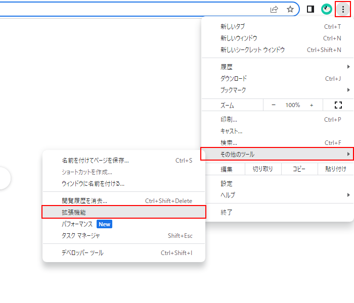
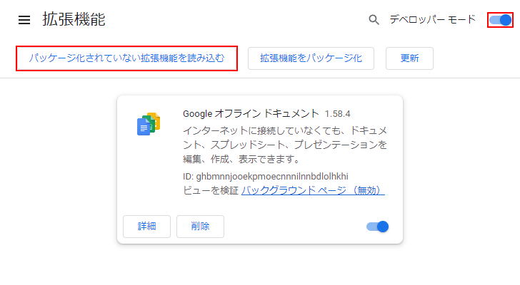

# テストTips

ここでは、ストアで公開されていない拡張機能を読み込む方法を説明します。

あらかじめ、ダウンロードした拡張機能のファイルを展開しておきます。

## Chromeの場合

1. `chrome://extensions/`にアクセスする

2. `manifest.json`が含まれるディレクトリを指定して読み込む

        
## Edgeの場合

1. `edge://extensions/`にアクセスする

2. `manifest.json`が含まれるディレクトリを指定して読み込む

        
## Firefoxの場合

1. `about:addons`にアクセスする

2. `about:debugging#/runtime/this-firefox`にアクセスする

3. `manifest.json`を指定して読み込む

        